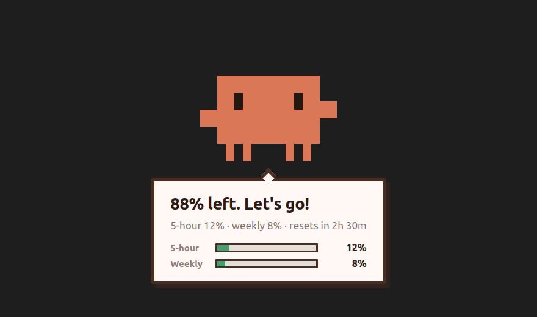
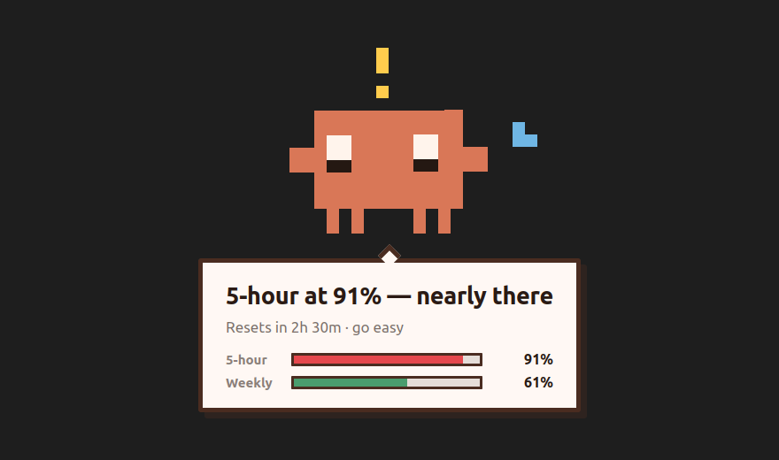
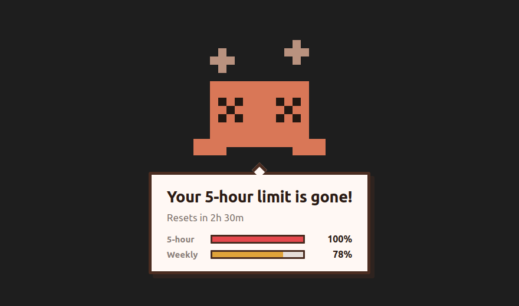

# Claude Usage Tracker

**A pixel Claude character that tells you your Claude usage before you ask.**
A Linux desktop tray app that reads the official Claude usage API and pops up on
your screen when you hit 50%, 70%, 90% and 100% — so you never discover the
limit by being cut off mid-task.

[](https://github.com/HosungJu/claude-usage-tracker/releases/latest)
[](#install)
[](https://github.com/HosungJu/claude-usage-tracker/releases/latest)
[](LICENSE)

[한국어 문서 →](README.ko.md) · [Website](https://hosungju.github.io/claude-usage-tracker/)



---

## Why this exists

Every other Claude usage tool has the same shape: a bar chart you have to open,
or a number you have to hover over. That means **you only learn your usage when
you already thought to check.** The moment that actually matters — the moment
you're about to lose your five-hour window mid-refactor — is the moment you
weren't looking.

This app inverts that. It sits in your tray, polls the usage API, and when you
cross a threshold **the character comes to you.** You do nothing.

| 90% — worried | 100% — out |
|---|---|
|  |  |

## What it does

- **Tells you first.** Character appears at 50 / 70 / 90 / 100% of your five-hour
  and weekly limits. Thresholds are configurable.
- **Waits until you're actually there.** If you're away from the keyboard or the
  screen is locked, it holds the message until you come back. An alert you
  didn't see is an alert that didn't happen.
- **Shows on every monitor.** On Wayland an app cannot ask where your cursor or
  windows are — so instead of guessing which screen you're looking at, it draws
  on all of them. You can't be wrong if you don't guess.
- **Greets you when a Claude Code session starts.** Optional `SessionStart` hook
  integration tells you what's left before you begin.
- **Stays out of the way.** Transparent, click-through overlay. No taskbar entry,
  never steals focus, gone in 3 seconds.
- **Tray at a glance.** The tray icon is generated from the character itself and
  changes expression with your usage level.
- **Speaks English or Korean.** Follows your desktop language by default; you can
  pin either one in Settings. Every surface is translated — the character's lines,
  the tray, the settings window, errors, the CLI, and the log file you would send
  to someone for help.

## Install

Download the AppImage from the [latest release](https://github.com/HosungJu/claude-usage-tracker/releases/latest):

```bash
chmod +x claude-usage-tracker-*-x86_64.AppImage
./claude-usage-tracker-*-x86_64.AppImage
```

No window opens — that's correct. Look for the tray icon. A window-less tray app
is this program's normal state.

There is no installer. It's one file: put it wherever you like, delete it and
`~/.config/claude-usage-tracker/` to uninstall.

**Optional — session hooks.** To have the character greet you when a Claude Code
session starts:

```bash
npm run cli -- --install-hooks    # from a clone of this repo
```

**Optional — start on login.** Tray → *Settings* → *Start on login*.
Writes an XDG autostart entry.

## Requirements

- Linux with a desktop environment (developed and verified on GNOME/Wayland;
  X11 and KDE/XFCE should work — the app uses XDG standards throughout)
- [Claude Code](https://claude.com/claude-code) installed and signed in — the
  app reads your existing OAuth token from `~/.claude/.credentials.json`
- No account, key, or configuration of its own

## How it reads your usage

It calls the same endpoint Claude Code itself uses:

```
GET https://api.anthropic.com/api/oauth/usage
Authorization: Bearer <token from ~/.claude/.credentials.json>
anthropic-beta: oauth-2025-04-20
```

The response carries real utilization percentages for the five-hour window, the
seven-day window, and any model-scoped limits — not token counts you have to
convert yourself.

**Your token never leaves your machine and is never written to a log.** The
logger scrubs anything that looks like a credential, deliberately over-eagerly,
because a log file is something you send to a stranger when you ask for help.

## Configuration

Tray → *Settings*, or `~/.config/claude-usage-tracker/settings.json`.

| Setting | Default | Range |
|---|---|---|
| Alert thresholds | 50, 70, 90, 100 | 1–100, auto-sorted and de-duplicated |
| Hold time when you're looking | 3s | 1–30s |
| Wait if you're away | on | |
| Poll interval | 60s | 15–600s |
| Show on screen | on | off = tray only |
| Which monitor | all | all / primary / cursor / specific |
| Anchor | screen center (large) | center / screen corner / active window |
| Corner | top-left | four corners (ignored in center mode) |
| Edge margin | 24px | 0–200px |
| Greet on session start | on | |
| Start on login | off | XDG autostart |
| Language | system | System / English / 한국어 |

## Comparison

| | This app | Bar-chart dashboards | `/status` in the CLI |
|---|---|---|---|
| Tells you unprompted | **yes** | no | no |
| Works while you're in another app | **yes** | no | no |
| Waits until you're at the keyboard | **yes** | n/a | n/a |
| Multi-monitor | **all screens** | n/a | n/a |
| Reads official usage API (real %) | **yes** | varies | yes |

## Build from source

```bash
npm install
npm run dev        # run with live usage polling
npm run demo       # replay the 50/70/90/100 scenes, 8s apart
npm test           # 317 tests
npm run package    # build the AppImage into release/
```

The download is ~70 MiB. Almost all of that is Electron — the application code
is a 131 KB asar. An empty Electron app built with the same settings comes to
72.8 MiB, so this is already below the stock floor: unused locales, the crash
handler and the SwiftShader software renderer are stripped at package time. See
[README.ko.md](README.ko.md#패키징) for the full accounting.

## How it's built

- **Electron + TypeScript**, no UI framework
- The character is **drawn in code**, not shipped as image assets — a pixel grid
  primitive plus a minimal PNG encoder, so the tray icon and the app icon are
  both generated from the same sprite at build time and can never drift
- Headless core (`src/core/`) with no UI dependency, so usage polling, threshold
  evaluation and state persistence are all testable without a display

## FAQ

**Does it work on macOS or Windows?**
Not yet. The overlay, autostart and idle detection are written against Linux/XDG
and GNOME interfaces. The core is portable; the shell is not.

**Does it need my API key?**
No. It reuses the OAuth token Claude Code already stored. If you're signed in to
Claude Code, you're done.

**Does it cost tokens to check my usage?**
No. The usage endpoint is metadata, not inference.

**Will it interrupt me?**
It draws a click-through overlay that never takes focus, and it disappears after
3 seconds. If you're away it waits rather than showing to an empty chair.

**Why a character instead of a notification?**
Desktop notifications are the thing you have trained yourself to ignore. That is
precisely the wrong medium for "you are about to lose your working session."

## License

MIT — see [LICENSE](LICENSE).

---

<sub>Keywords: Claude usage tracker, Claude Code usage monitor, Claude usage
limit notifier, Claude 5-hour limit, Claude weekly limit, Anthropic usage API,
Claude desktop app Linux, Claude usage AppImage, Claude rate limit alert.</sub>
